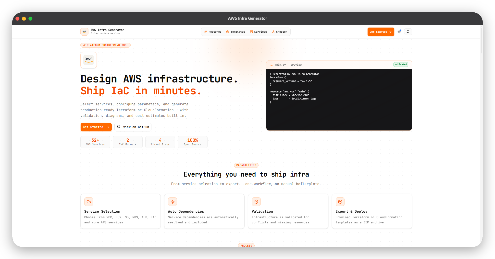

<p align="center">
  <h1>🚀 AWS Infra Generator</h1>
</p>

<p align="center">
  
</p>

<p align="center">
  <strong>A comprehensive platform engineering tool that allows users to design AWS infrastructure through an intuitive interface and automatically generate <strong>Infrastructure as Code (IaC)</strong> templates using <strong>Terraform</strong> or <strong>AWS CloudFormation</strong>.</strong>
</p>

<p align="center">
  Instead of manually writing infrastructure code, users can select the AWS services they need, visualize their architecture, estimate costs, and instantly generate production-ready infrastructure templates.
</p>

---

## ✨ Features

### 🎯 Core Features
- **Infrastructure Template Generation** — Generate Terraform or CloudFormation templates automatically
- **32+ AWS Services Support** — VPC, EC2, Lambda, ECS, EKS, S3, EFS, RDS, DynamoDB, ElastiCache, ALB, API Gateway, CloudFront, Route 53, IAM, SQS, SNS, CloudWatch, Step Functions, EventBridge, Kinesis, Secrets Manager, KMS, AWS Config, AWS Backup, Cognito, CodeBuild, CodePipeline, CodeDeploy, CloudFormation StackSets, and more
- **Service Dependency Engine** — Auto-resolves dependencies (e.g., ALB → VPC + Subnets + Security Groups)
- **Multi-Environment Support** — Generate for development, staging, or production with environment-specific configurations
- **Infrastructure Validation** — Validates dependencies, config conflicts, and missing resources before generation
- **Preset Architecture Templates** — Quick-start templates for common architectures:
  - Simple Web Application
  - Serverless API
  - Microservices Application
  - Data Analytics Pipeline
  - Machine Learning Pipeline
  - Static Website Hosting
- **Export & Download** — Download generated templates as a ZIP archive with proper file structure
- **Responsive Design** — Fully responsive UI that works on mobile, tablet, and desktop devices

### 🎉 New Features (v1.1.0)

#### 💰 Cost Estimation Calculator
- **Real-time cost estimates** for your AWS infrastructure
- **Monthly and yearly projections** with detailed breakdowns
- **Service-by-service cost analysis** with itemized components
- **Environment-aware pricing** (development, staging, production)
- **Cost optimization tips** to reduce AWS spending
- **27+ services covered** with accurate pricing data
- **Interactive expandable cards** to view detailed cost breakdowns

#### 📊 Infrastructure Diagram Visualization
- **Interactive visual architecture diagrams** showing all services and relationships
- **Hierarchical layout algorithm** organizing services by dependency layers
- **Category-based color coding** for easy service identification
- **Dependency highlighting** on hover to see service relationships
- **Export to SVG** for documentation and presentations
- **Fullscreen mode** for detailed viewing
- **Layer indicators** showing infrastructure hierarchy
- **Professional design** with gradients, shadows, and smooth animations

#### 🔍 Terraform Plan Preview
- **Simulated terraform plan** output before generation
- **Resource-level change tracking** (create/update/destroy)
- **Attribute-level diff** showing exactly what will change
- **Sensitive value masking** for passwords and keys
- **Filter by action type** (create, update, destroy)
- **Warning system** for costs, security, and deployment time
- **Estimated deployment time** for planning purposes
- **Next steps guidance** with terraform commands

> See [NEW_FEATURES.md](NEW_FEATURES.md) for detailed documentation on the new features.

### 🛠️ Recent Improvements (v1.1.1)
- **Complete Service Coverage** — All 20+ AWS services now have fully functional generators
- **Bug Fixes** — Resolved missing service generators for CloudFront, ECS, EKS, and DynamoDB
- **Enhanced Validation** — Improved configuration validation and error handling
- **Template Quality** — Production-ready Terraform and CloudFormation templates

### 🚀 New DevOps Services (v1.2.0)
- **12 New DevOps-Focused Services** — Added comprehensive support for modern DevOps workflows:
  - **Step Functions** — Serverless workflow orchestration
  - **EventBridge** — Event-driven architecture
  - **Kinesis** — Real-time data streaming
  - **Secrets Manager** — Secure secrets management
  - **KMS** — Encryption key management
  - **AWS Config** — Configuration compliance
  - **AWS Backup** — Centralized backup service
  - **Cognito** — User authentication
  - **CodeBuild** — Continuous integration
  - **CodePipeline** — Continuous delivery
  - **CodeDeploy** — Automated deployments
  - **CloudFormation StackSets** — Multi-account provisioning
- **Full Generator Support** — All new services have complete Terraform and CloudFormation generators
- **Cost Estimation** — Pricing data and cost estimation for all new DevOps services
- **Icon Support** — New service icons for infrastructure diagrams

---

## 🛠️ Supported AWS Services

### Compute
- **EC2** — Elastic Compute Cloud with multiple instance types, Auto Scaling, and Load Balancing
- **Lambda** — Serverless computing with multiple runtimes, event-driven execution
- **ECS** — Container orchestration with Docker support and Fargate
- **EKS** — Managed Kubernetes with auto-updates and AWS integration

### Storage
- **S3** — Object storage with versioning, encryption, and lifecycle policies
- **EFS** — Elastic File System for shared storage across EC2 instances

### Database
- **RDS** — Managed relational databases (MySQL, PostgreSQL, MariaDB, Oracle, SQL Server)
- **DynamoDB** — NoSQL database with auto-scaling and global tables
- **ElastiCache** — In-memory caching with Redis and Memcached support

### Networking
- **VPC** — Virtual Private Cloud with isolated networks, subnets, and route tables
- **ALB** — Application Load Balancer with health checks and SSL termination
- **API Gateway** — API management with REST/HTTP APIs, CORS, and throttling
- **CloudFront** — Content Delivery Network with edge locations
- **Route 53** — DNS service with domain registration and health checks

### Security & Identity
- **IAM** — Identity and Access Management with roles and policies

### Messaging
- **SQS** — Simple Queue Service for message queuing
- **SNS** — Simple Notification Service for pub/sub messaging

### Management & Monitoring
- **CloudWatch** — Monitoring with logs, metrics, alarms, and dashboards

### DevOps & CI/CD
- **Step Functions** — Serverless workflow orchestration for AWS services
- **EventBridge** — Serverless event bus for building event-driven applications
- **Kinesis** — Data streaming service for real-time data processing
- **Secrets Manager** — Secure secrets management for applications
- **KMS** — Key Management Service for encryption and key management
- **AWS Config** — Configuration management and compliance monitoring
- **AWS Backup** — Centralized backup service for AWS resources
- **Cognito** — User authentication and authorization for web/mobile apps
- **CodeBuild** — Fully managed continuous integration service
- **CodePipeline** — Continuous delivery service for release automation
- **CodeDeploy** — Automated deployment service for applications
- **CloudFormation StackSets** — Multi-account and multi-region infrastructure provisioning

---

## 🧰 Tech Stack

| Layer | Technology |
|-------|-----------|
| Frontend | Next.js, React, Tailwind CSS, shadcn/ui |
| State Management | Zustand |
| Infrastructure Generation | Client-side TypeScript (Terraform & CloudFormation) |
| Template Engine | TypeScript template builders |
| Packaging | Browser-based ZIP export (JSZip) |

---

## 🚀 Getting Started

### Prerequisites

- **Node.js** >= 18
- **npm** or **yarn**

### 1. Clone the repository

```bash
git clone https://github.com/NotHarshhaa/aws-infra-generator.git
cd aws-infra-generator
```

### 2. Install dependencies

```bash
npm install
```

### 3. Start the Application

```bash
npm run dev
```

The app will be available at `http://localhost:3000`.

**Note**: This application runs entirely in the browser without requiring a backend server. All infrastructure generation happens client-side using TypeScript implementations.

---

## 🖥 Example Workflow

### 1. Select Infrastructure

Choose services like VPC, EC2, RDS, S3 from the UI, or use a preset template for common architectures.

### 2. Configure Options

```
Project Name: my-infra
Region: us-east-1
Environment: production
Output Format: Terraform

EC2 Instance Type: t3.medium
EC2 Count: 3
Database Engine: PostgreSQL
RDS Instance Class: db.t3.medium
```

### 3. Review & Validate

Use the integrated tools to validate your infrastructure:

- **💰 Cost Estimator** — View estimated monthly costs ($127.45/month)
- **📊 Diagram** — Visualize your architecture and dependencies
- **🔍 Plan Preview** — See what resources will be created (12 resources)

### 4. Generate Infrastructure

The tool generates a complete project structure:

**Terraform output:**
```
my-infra/
├── main.tf
├── variables.tf
├── vpc.tf
├── ec2.tf
├── rds.tf
├── s3.tf
└── outputs.tf
```

**CloudFormation output:**
```
my-infra/
└── template.json
```

### 4. Deploy

```bash
# Terraform
cd my-infra
terraform init
terraform plan
terraform apply

# CloudFormation
aws cloudformation deploy \
  --template-file template.json \
  --stack-name my-infra-stack \
  --capabilities CAPABILITY_IAM
```

---

## 📡 Key Features & Functions

| Feature | Description |
|---------|-------------|
| **Template Generation** | Generate Terraform or CloudFormation templates locally in the browser |
| **Infrastructure Validation** | Validate dependencies, conflicts, and missing resources before generation |
| **Cost Estimation** | Calculate real-time AWS costs with detailed service breakdowns |
| **Diagram Visualization** | Generate interactive SVG architecture diagrams with dependencies |
| **Plan Preview** | Simulate terraform plan output showing resource changes |
| **ZIP Export** | Download complete infrastructure as a ZIP archive |
| **SVG Export** | Export architecture diagrams for documentation |
| **Preset Templates** | Quick-start with 8+ pre-configured architecture templates |

---

## 🏗 Architecture

```
┌─────────────────────────────────────────────────────────┐
│         Frontend UI (Next.js + shadcn/ui)               │
│  ┌──────────┐  ┌──────────┐  ┌──────────┐  ┌─────────┐ │
│  │ Service  │  │   Cost   │  │ Diagram  │  │  Plan   │ │
│  │ Selector │  │Estimator │  │Generator │  │ Preview │ │
│  └──────────┘  └──────────┘  └──────────┘  └─────────┘ │
└─────────────────────────────────────────────────────────┘
                        ↓
┌─────────────────────────────────────────────────────────┐
│   Client-side Infrastructure Generation (TypeScript)    │
│  ┌──────────────┐  ┌──────────────┐  ┌──────────────┐  │
│  │ Dependency   │  │ Validation   │  │ Cost         │  │
│  │ Resolution   │  │ Engine       │  │ Calculator   │  │
│  └──────────────┘  └──────────────┘  └──────────────┘  │
└─────────────────────────────────────────────────────────┘
                        ↓
┌─────────────────────────────────────────────────────────┐
│      Terraform / CloudFormation Builders                │
│  ┌──────────────┐  ┌──────────────┐  ┌──────────────┐  │
│  │  Template    │  │  Variables   │  │   Outputs    │  │
│  │  Generation  │  │  Generation  │  │  Generation  │  │
│  └──────────────┘  └──────────────┘  └──────────────┘  │
└─────────────────────────────────────────────────────────┘
                        ↓
┌─────────────────────────────────────────────────────────┐
│         Browser-based Export (JSZip)                    │
│  ┌──────────────┐  ┌──────────────┐                    │
│  │  ZIP Archive │  │  SVG Diagram │                    │
│  │   Download   │  │   Download   │                    │
│  └──────────────┘  └──────────────┘                    │
└─────────────────────────────────────────────────────────┘
```

---

## 🚀 Roadmap

### ✅ Completed (v1.1.0)
- [x] **Infrastructure cost estimation** — Real-time AWS cost calculator with detailed breakdowns
- [x] **Terraform plan preview** — Simulated terraform plan showing resource changes
- [x] **Infrastructure visualization (diagram)** — Interactive architecture diagrams with dependencies

### 🔜 Upcoming
- [ ] GitOps integration (GitHub Actions, GitLab CI)
- [ ] Multi-cloud support (Azure / GCP)
- [ ] More preset architecture templates
- [ ] AWS CDK output support
- [ ] Cost optimization recommendations
- [ ] Infrastructure compliance checks

---

## 👨‍💻 Use Cases

### For DevOps Engineers
- **Rapid Prototyping** — Quickly design and validate infrastructure before deployment
- **Cost Planning** — Estimate AWS costs before committing to infrastructure
- **Architecture Documentation** — Generate visual diagrams for team reviews and documentation
- **Infrastructure Standardization** — Use preset templates for consistent deployments

### For Platform Engineering Teams
- **Internal Developer Platforms** — Provide self-service infrastructure generation
- **Template Libraries** — Build and share standardized architecture patterns
- **Cost Governance** — Review and approve infrastructure costs before deployment
- **Compliance Checks** — Validate infrastructure against organizational standards

### For Developers
- **Learning AWS** — Understand AWS service relationships and dependencies
- **Quick Setup** — Generate infrastructure for applications without deep IaC knowledge
- **Cost Awareness** — Learn about AWS pricing and cost implications
- **Best Practices** — Generate infrastructure following AWS best practices

### For Startups & Small Teams
- **Budget Planning** — Plan infrastructure costs for investor presentations
- **Fast Iteration** — Quickly test different infrastructure configurations
- **No DevOps Required** — Generate production-ready infrastructure without dedicated DevOps
- **Cost Optimization** — Identify and reduce unnecessary infrastructure costs

### For Consultants & Agencies
- **Client Projects** — Generate consistent infrastructure for multiple clients
- **Proposals** — Create architecture diagrams and cost estimates for proposals
- **Knowledge Transfer** — Provide clients with documented, visual infrastructure
- **Time Savings** — Reduce infrastructure setup time by 50-70%

---

## 🎯 Key Benefits

### ⏱️ Time Savings
- **10x Faster** than writing IaC manually
- **Pre-configured templates** for common architectures
- **Automatic dependency resolution** eliminates configuration errors
- **Instant generation** with no waiting for backend processing

### 💰 Cost Optimization
- **Know costs upfront** before deploying infrastructure
- **Compare configurations** to find the most cost-effective solution
- **Optimization tips** to reduce AWS spending by up to 70%
- **Environment-based estimates** for accurate budget planning

### 🛡️ Risk Reduction
- **Validation engine** catches errors before deployment
- **Plan preview** shows exactly what will be created
- **Dependency checking** ensures all required resources are included
- **Best practices** built into generated templates

### 📚 Learning & Documentation
- **Visual diagrams** help understand AWS architecture
- **Service relationships** clearly shown with dependencies
- **Production-ready code** follows AWS best practices
- **Exportable diagrams** for team documentation

### 🚀 Developer Experience
- **No backend required** — runs entirely in the browser
- **Instant feedback** with real-time validation
- **Responsive design** works on all devices
- **Modern UI** with intuitive navigation

---

## 📊 Feature Comparison

| Feature | AWS Infra Generator | Manual IaC | AWS Console |
|---------|-------------------|------------|-------------|
| **Visual Architecture** | ✅ Interactive diagrams | ❌ No visualization | ⚠️ Limited |
| **Cost Estimation** | ✅ Real-time estimates | ❌ Manual calculation | ⚠️ After deployment |
| **Plan Preview** | ✅ Simulated plan | ✅ Requires setup | ❌ No preview |
| **Multi-format Output** | ✅ Terraform + CloudFormation | ⚠️ Choose one | ❌ Console only |
| **Dependency Resolution** | ✅ Automatic | ❌ Manual | ⚠️ Partial |
| **Preset Templates** | ✅ 8+ templates | ❌ Start from scratch | ❌ No templates |
| **Learning Curve** | ✅ Beginner-friendly | ❌ Steep | ⚠️ Moderate |
| **Time to Deploy** | ✅ Minutes | ❌ Hours/Days | ⚠️ Hours |

---

## 🌟 What Makes It Special

1. **🎨 Beautiful UI** — Modern, intuitive interface built with Next.js and shadcn/ui
2. **⚡ Lightning Fast** — Client-side generation means instant results
3. **🔒 Privacy First** — No data sent to servers, everything runs in your browser
4. **📱 Mobile Friendly** — Fully responsive design works on all devices
5. **🎓 Educational** — Learn AWS architecture while building infrastructure
6. **💼 Production Ready** — Generated code follows AWS best practices
7. **🔄 Flexible** — Support for both Terraform and CloudFormation
8. **🎯 Comprehensive** — 32+ AWS services with detailed configuration options

---

## 🛠️ Author & Community

Built with passion and purpose by [**Harshhaa**](https://github.com/NotHarshhaa).  
Your ideas, feedback, and contributions are what make this project better.

Let’s shape the future of cloud infrastructure together with AWS Infra Generator! 🚀

**Connect & Collaborate:**  

* **GitHub:** [@NotHarshhaa](https://github.com/NotHarshhaa)  
* **Blog:** [ProDevOpsGuy](https://blog.prodevopsguytech.com)  
* **Telegram Community:** [Join Here](https://t.me/prodevopsguy)  
* **LinkedIn:** [Harshhaa Vardhan Reddy](https://www.linkedin.com/in/NotHarshhaa/)  

---

## ⭐ How You Can Support

If you found this project useful:  

* ⭐ **Star** the repository to show your support  
* 📢 **Share** it with your friends and colleagues  
* 📝 **Open issues** or **submit pull requests** to help improve it

---

### 📢 Stay Connected

[](https://github.com/NotHarshhaa)

Join the community, share your experience, and help us grow!
